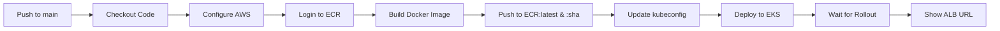

# GitHub CI/CD Setup Guide

## Step 1: Create GitHub Repository

1. Go to https://github.com/new
2. Create a new repository named `devops-practice` (or your preferred name)
3. **Do NOT initialize** with README, .gitignore, or license (we already have those)
4. Click "Create repository"

## Step 2: Push Your Code

```powershell
# Add GitHub remote (replace YOUR_USERNAME with your GitHub username)
git remote add origin https://github.com/YOUR_USERNAME/devops-practice.git

# Rename branch to main (if needed)
git branch -M main

# Push code
git push -u origin main
```

## Step 3: Configure GitHub Secrets

Go to your repository → Settings → Secrets and variables → Actions → New repository secret

Add these **3 required secrets**:

### 1. AWS_ACCESS_KEY_ID
- Value: Your AWS access key ID
- Get it from: AWS Console → IAM → Users → Your User → Security credentials
- Or from: `~/.aws/credentials` file

### 2. AWS_SECRET_ACCESS_KEY
- Value: Your AWS secret access key
- From the same location as access key ID

### 3. AWS_REGION
- Value: `us-east-2`
- This is your EKS cluster region

## Step 4: Verify Secrets

Go to Settings → Secrets and variables → Actions

You should see:
- ✅ AWS_ACCESS_KEY_ID
- ✅ AWS_SECRET_ACCESS_KEY
- ✅ AWS_REGION

## Step 5: Enable GitHub Actions

1. Go to repository → Actions tab
2. If prompted, click "I understand my workflows, go ahead and enable them"
3. You should see the workflow: "Deploy to EKS"

## Step 6: Test the CI/CD Pipeline

### Option 1: Manual Trigger
1. Go to Actions → Deploy to EKS workflow
2. Click "Run workflow" → select "main" branch → Run workflow

### Option 2: Code Change Trigger
```powershell
# Make a small change to trigger the pipeline
cd app/src/main/java/com/example/demo
# Edit DemoController.java - change the message

git add .
git commit -m "Test CI/CD: Update welcome message"
git push
```

## Step 7: Monitor the Deployment

1. Go to Actions tab
2. Click on the running workflow
3. Watch the build and deployment progress

The pipeline will:
- ✅ Build Docker image
- ✅ Push to ECR with git SHA tag + latest
- ✅ Deploy to EKS cluster
- ✅ Wait for rollout completion
- ✅ Display the ALB URL

## What the CI/CD Pipeline Does



## Current Infrastructure

- **EKS Cluster**: `dev-eks-cluster` (us-east-2)
- **ECR Repository**: `676206948248.dkr.ecr.us-east-2.amazonaws.com/dev-devops-practice-app`
- **ALB URL**: `http://k8s-default-devopspr-97a5afc0dc-637287727.us-east-2.elb.amazonaws.com`
- **Deployment**: 2 replicas in `default` namespace

## Workflow Features

✅ **Automatic Triggers**: Runs on push to `main` branch when:
- `app/**` files change
- `k8s/**` files change
- Workflow file itself changes

✅ **Manual Trigger**: Can run manually via GitHub Actions UI

✅ **Image Tagging**: 
- `latest` tag for dynamic deployments
- Git SHA tag for versioning and rollbacks

✅ **Health Checks**: Waits for deployment rollout completion

## Troubleshooting

### Build Fails: AWS Credentials
- Verify secrets are set correctly
- Check IAM user has ECR and EKS permissions

### Deployment Fails: kubectl
- Ensure AWS credentials have EKS access
- Verify cluster name matches: `dev-eks-cluster`

### Image Pull Fails
- Check ECR repository exists
- Verify node IAM role has ECR pull permissions

## Quick Commands

```powershell
# View workflow runs
gh run list

# View specific run logs
gh run view <run-id> --log

# Re-run failed workflow
gh run rerun <run-id>

# Check deployment status
kubectl get deployment devops-practice-app -n default
kubectl get pods -l app=devops-practice-app

# Check application
curl http://k8s-default-devopspr-97a5afc0dc-637287727.us-east-2.elb.amazonaws.com/api/hello
```

## Next Steps

1. ✅ Push code to GitHub
2. ✅ Configure secrets
3. ✅ Run workflow manually to test
4. ✅ Make a code change and push to trigger automatic deployment
5. 🎉 Your CI/CD is fully automated!
